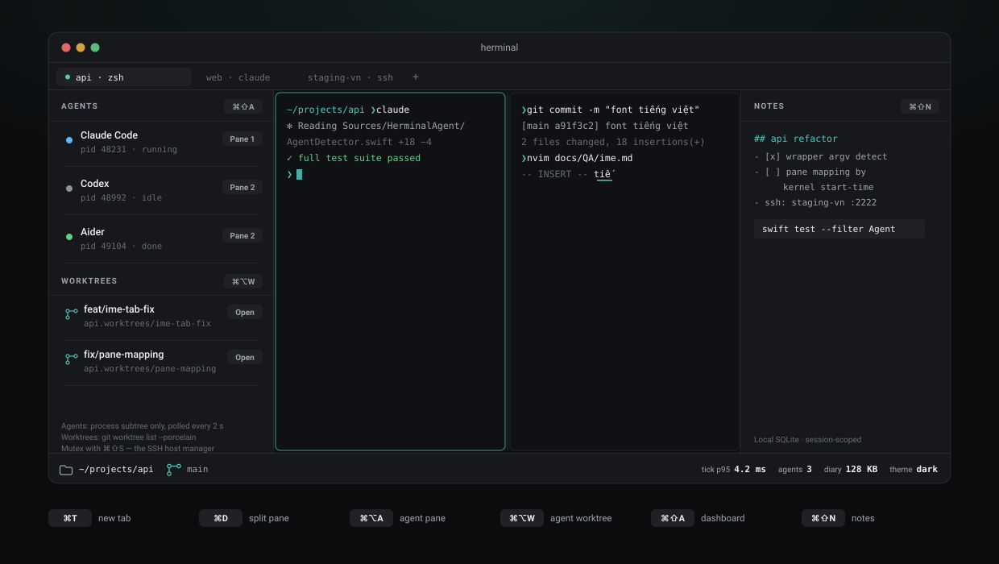
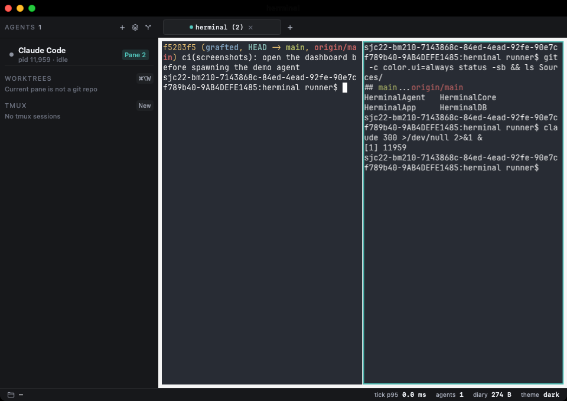
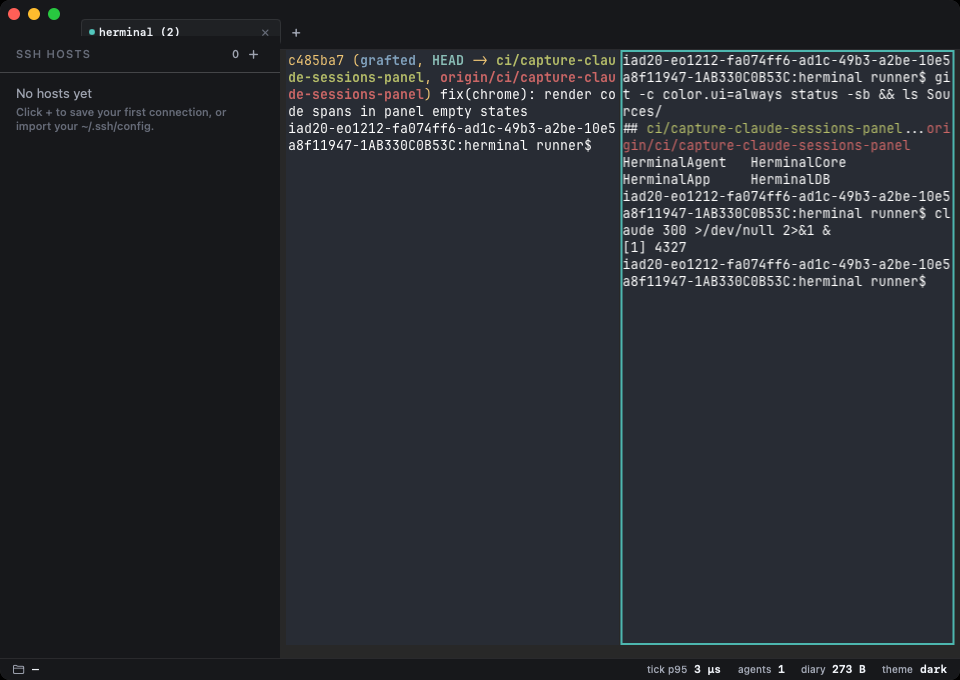
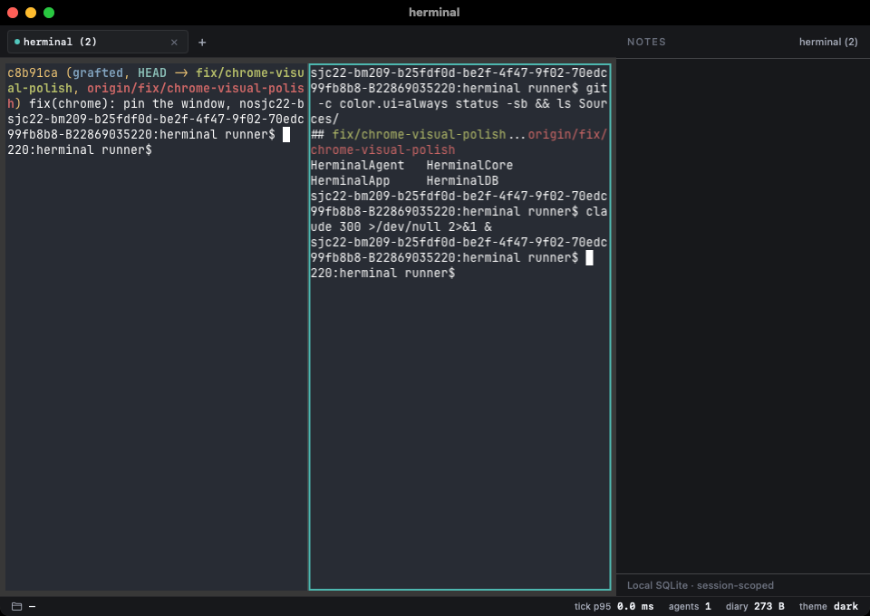
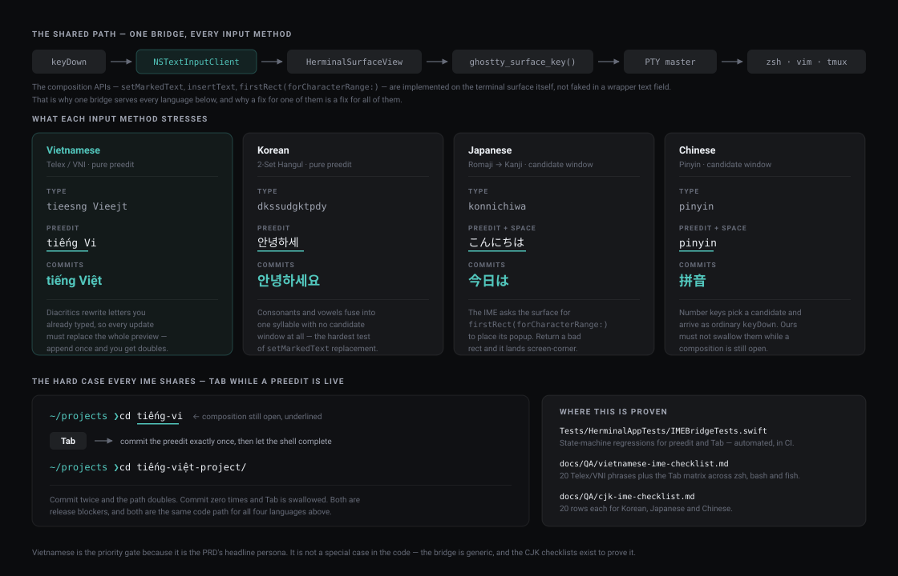
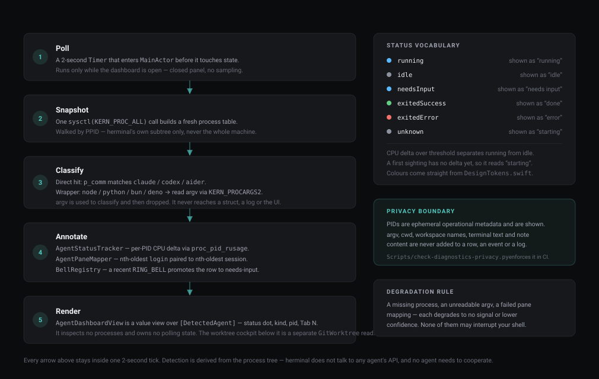
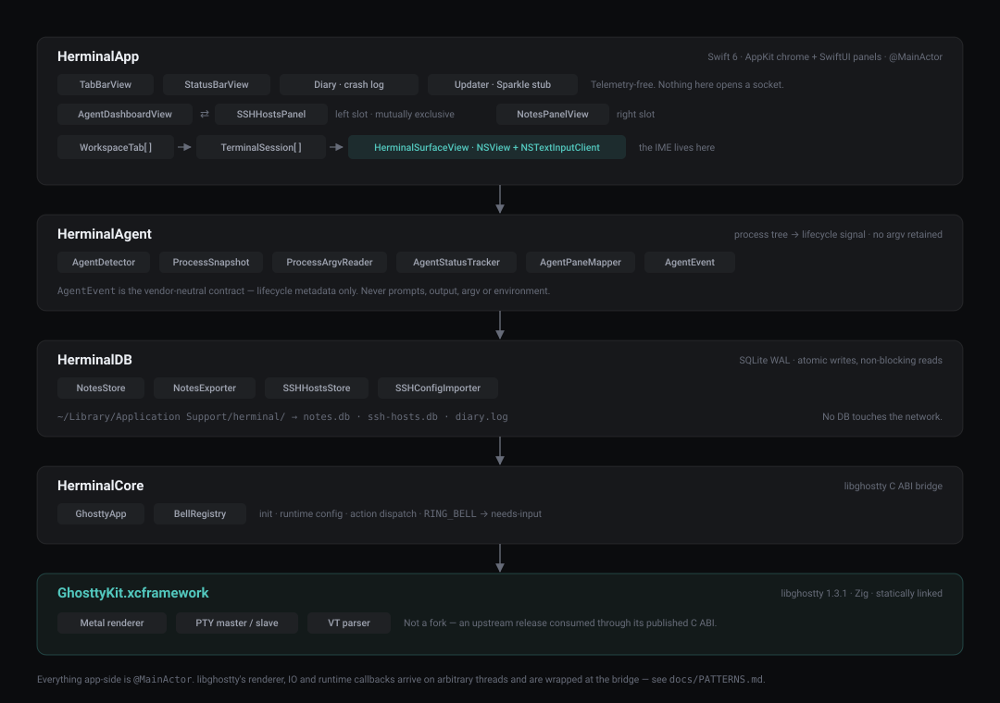

# herminal

> AI-native macOS terminal cho Vietnamese developers chạy Claude Code và
> agent CLIs hằng ngày.

**Website:** <https://hoang.tech/herminal/> · **Download:** [latest release](https://github.com/hoangperry/herminal/releases/latest) · **Source:** this repo

[](https://github.com/hoangperry/herminal/actions/workflows/ci.yml)
[](LICENSE)
[](https://www.apple.com/macos)
[](https://swift.org)

**Status:** `v1.0.0` release candidate on `main`; latest public release is
[`v0.4.2`](https://github.com/hoangperry/herminal/releases/tag/v0.4.2).
See [CHANGELOG](CHANGELOG.md).
**Platform:** macOS 14+ Apple Silicon.

> 🇻🇳 Phiên bản tiếng Việt: [`README.vi.md`](README.vi.md)



*Live agents and worktrees on the left, splits in the middle, per-session
notes on the right. The left slot is one slot: the agent dashboard and the
SSH manager take turns in it.*

<!-- Screenshots of the running app land here. Run
     Scripts/capture-screenshots.sh (needs Screen Recording + Accessibility
     granted to your terminal), then delete this comment wrapper.

| | |
|---|---|
|  |  |
|  |  |

-->

---

## What is herminal

A local-first macOS terminal built around two daily realities the existing
2026 terminals each miss part of:

1. **You run Claude Code / Codex / Aider all day** and need a glanceable
   view of which agents are alive, idle, or done — without an
   open-a-second-window detour.
2. **You type a language an English keyboard can't reach** — Vietnamese
   Telex / VNI, Korean 2-Set Hangul, Japanese romaji, Chinese Pinyin —
   and need the composition to land correctly the first time, in tmux,
   in vim, every time.

herminal pairs the [libghostty](https://github.com/ghostty-org/ghostty)
engine (Zig, mature, native performance) with a Swift / AppKit shell that
owns the IME and the chrome. Storage is SQLite for both per-session notes
and saved SSH hosts. No cloud, no telemetry, no account.



*The composition APIs live on the terminal surface itself, not in a
wrapper text field — so one bridge serves every input method macOS
offers. Vietnamese is the release gate because it's the PRD's headline
persona, not because it's special-cased in code.*

## Why a new terminal

In 2026 nothing on the market hits all five at once:

| Need | iTerm2 | Warp | Wave | Ghostty | **herminal** |
|---|---|---|---|---|---|
| Native macOS speed | ✓ | partial | partial | ✓ | ✓ |
| Vietnamese IME + in-preedit shell completion | ✓ | × | × | partial | RC¹ |
| tmux + multi-session | ✓ | partial | × | ✓ | ✓ |
| Built-in agent dashboard | × | partial | × | × | ✓ |
| Local-only persistent notes per session | × | × | × | × | ✓ |

The IME row is scored on Vietnamese because that's the rubric's persona.
The bridge underneath is generic — Korean, Japanese and Chinese get their
own smoke matrix in
[`docs/QA/cjk-ime-checklist.md`](docs/QA/cjk-ime-checklist.md).

See [`docs/research/`](docs/research/) for the full comparison and
scoring rubric the table is derived from.

## v1 scope

Built on `main`; public v1 remains a release candidate:

- [x] Native terminal core via libghostty (Metal renderer, p95 keystroke <5ms)
- [x] Vietnamese IME bridge with automated Tab/preedit regressions; live Telex/VNI release gate pending¹
- [x] Multi-session workspace + vertical/horizontal splits
- [x] Agent dashboard with running / idle / starting discrimination
- [x] Per-session notes (SQLite WAL) with Markdown round-trip
- [x] SSH Connection Manager with one-click spawn
- [x] Premium dark chrome (Raycast/Linear style)
- [x] tmux compatibility verified against vim, less, htop, fzf, lazygit, btop, starship
- [x] Telemetry-free local crash diary
- [x] Developer-ID codesign + notarize pipeline

¹ The implementation and state-transition regressions are green, but the
release-blocking system-input-source matrix still requires a dated human run.
See [issue #2](https://github.com/hoangperry/herminal/issues/2).

Deferred to post-MVP — see [CHANGELOG.md](CHANGELOG.md) "Known
limitations": agent↔pane mapping, recursive split trees, drag-to-resize
dividers, light theme, group/search in SSH manager.

## Install

### Homebrew (recommended)

```sh
brew install --cask hoangperry/herminal/herminal
```

`brew upgrade --cask herminal` keeps it current. Public artifacts must be
Developer-ID signed, notarized, and stapled so Gatekeeper can validate them;
macOS may still show its standard first-open confirmation.

### Direct download

1. Grab `herminal-vX.Y.Z.dmg` from the
   [Releases](https://github.com/hoangperry/herminal/releases/latest) page.
2. Open the DMG → drag `herminal.app` into `/Applications`.
3. Launch. Verify the publisher in the standard macOS first-open confirmation.

### From source

```sh
git clone --recurse-submodules https://github.com/hoangperry/herminal
cd herminal
Scripts/bootstrap.sh           # builds libghostty xcframework (~5-15 min cold)
Scripts/make-app-bundle.sh     # assembles .app with ad-hoc signature
open .build/herminal.app
```

Prereqs: Xcode 26+, Swift 6.2+, [Zig](https://ziglang.org) 0.15.2+
(for libghostty), `clang` for the kernel-probe binaries used by the
integration scripts.

## First-run quick tour

- **⌘T / ⌘W** — new tab / close current pane (closes tab when last)
- **⌘D / ⌘⇧D** — split vertical / horizontal
- **⌘⇧] / ⌘⇧[** — next / previous tab
- **⌘⌥A** — new Claude pane (split)
- **⌘⌥W** — new isolated agent worktree
- **⌘⇧A** — toggle agent dashboard (live agents + worktrees)
- **⌘1…⌘9** — jump to tab N / last tab
- **⌘⇧S** — toggle SSH host manager (mutex with the agent dashboard
  in the left slot)
- **⌘⇧N** — toggle the per-session notes panel on the right

Agents are detected by walking herminal's process subtree — start
`claude`, `codex`, or `aider` in any tab and they'll appear in the
dashboard within ~2 seconds with a `running` / `idle` / `starting`
badge tracked via CPU sampling.



*No agent has to cooperate and no API key is involved — the signal is
derived entirely from the process tree. `argv` is read only to recognise
`node` / `python` / `bun` / `deno` wrappers, and is dropped immediately
after. See [`docs/CONTRIBUTOR-TOUR-AGENT-SIGNAL.md`](docs/CONTRIBUTOR-TOUR-AGENT-SIGNAL.md)
to follow one signal end to end.*

## Tech stack

| Layer | Tech | Why |
|---|---|---|
| Terminal engine | [libghostty 1.3.1](https://github.com/ghostty-org/ghostty) (C ABI via Zig) | Mature, native, no Electron |
| App | Swift 6 + AppKit + SwiftUI chrome | Real `NSTextInputClient`, real Metal layer |
| Surface | `NSView` hosting libghostty's Metal layer | Pixel-precise IME |
| Storage | SQLite WAL (notes + SSH hosts) | Local-only, atomic, indexable |
| Distribution | Developer-ID signed + notarized DMG/zip and Homebrew cask | App Store sandbox is incompatible |



*libghostty is consumed as an upstream release through its published C
ABI — not vendored as a fork. Full write-up in
[`docs/ARCHITECTURE.md`](docs/ARCHITECTURE.md).*

## Repo layout

```
herminal/
├── Sources/
│   ├── HerminalCore/         # libghostty C ABI bridge
│   ├── HerminalDB/           # NotesStore + SSHHostsStore
│   ├── HerminalAgent/        # process-subtree + CPU-status detection
│   └── HerminalApp/          # NSApp, WorkspaceView, panels, Diary
├── App/                       # Info.plist + entitlements
├── Tests/                     # 175 Swift Testing tests
├── Scripts/                   # bootstrap, bundle, verify-*, dogfood, sign, release, capture-screenshots
├── Vendor/libghostty/         # git submodule (Ghostty v1.3.1)
└── docs/
    ├── assets/               # README diagrams + app screenshots
    ├── research/             # market scan + scoring
    ├── define/herminal.prd.md # source-of-truth PRD
    ├── backlog/              # monthly task lists + retrospectives
    ├── QA/                   # IME checklists (VI + CJK), dogfood checklist + journal
    └── launch/               # press kit + tweet/LinkedIn drafts
```

## Contributing

Read [CONTRIBUTING.md](CONTRIBUTING.md) first — the project is
opinionated about what's in scope. Bug reports go through the
[bug template](.github/ISSUE_TEMPLATE/bug_report.md) which prompts for
the diary excerpt; security issues go to
[SECURITY.md](SECURITY.md).

## Documentation

| Doc | Purpose |
|---|---|
| [CHANGELOG.md](CHANGELOG.md) | Per-version release notes |
| [CONTRIBUTING.md](CONTRIBUTING.md) | How to propose changes |
| [SECURITY.md](SECURITY.md) | How to report vulnerabilities |
| [docs/ARCHITECTURE.md](docs/ARCHITECTURE.md) | One-page system overview — read before the first PR |
| [docs/MAINTAINER-AI-POLICY.md](docs/MAINTAINER-AI-POLICY.md) | Human boundaries for AI-assisted maintenance |
| [docs/BETA.md](docs/BETA.md) | Privacy-safe beta protocol and evidence ledger |
| [docs/RELEASE.md](docs/RELEASE.md) | Cutting a signed + notarized release |
| [docs/define/herminal.prd.md](docs/define/herminal.prd.md) | The PRD that frames every decision |
| [docs/QA/dogfood-checklist.md](docs/QA/dogfood-checklist.md) | What to watch for during daily-driver use |
| [docs/QA/vietnamese-ime-checklist.md](docs/QA/vietnamese-ime-checklist.md) | 20-phrase Telex/VNI smoke matrix |
| [docs/QA/cjk-ime-checklist.md](docs/QA/cjk-ime-checklist.md) | Korean / Japanese / Chinese IME smoke matrices |
| [docs/backlog/](docs/backlog/) | Monthly task lists + retrospectives M1 → M7 |

---

Made with 🐈 by Yuuhou Meow team in Việt Nam.
